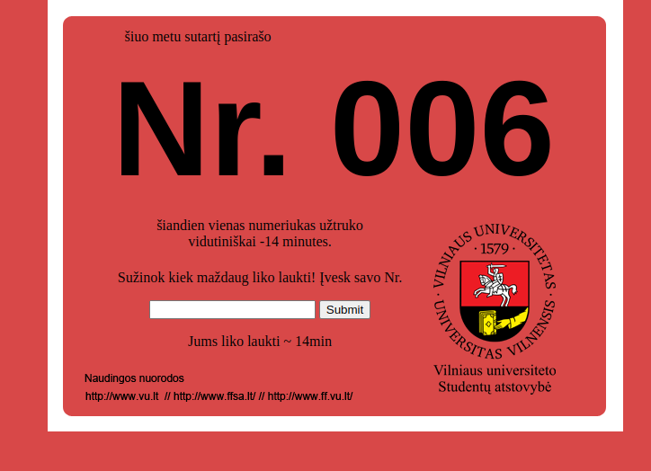

# How Long Can I Chill

Originally `kiekgalimachillint`

## Why

Signing a contract for university was boring with lines lasting 2-4 hours. [Vilnius University Students' Representation](https://ff.vusa.lt/l) decided to spruce up the signing process by adding enterainment - games, tours, etc. We feared that people wouldn't want to leave their long lines, so I suggested ticketing system like banks use, just available online.

## Idea

Soon to be students would grab a ticket as they show up, get a quick explanation how it works, and either stay in the area and be entertained, leave to explore the city, or just go get food. They could check the current ticket number by going to the [website](https://kiekdargaliuchilling.99k.org) and also what's the aproximate wait time left.

## Execution

When i proposed the idea, I had no clue how to execute it. I've had some html experience, and to make the websites I would designed them in Adobe Photoshop use slicer tool to cut it up, and replace the content areas with actual text. JavaScript was nowhere near my radar and the only php I've ever done was light editing WordPress themes. I had less than 14 hours to learn and execute it, by pulling an all nighter.

### Requirements

- Display Current Ticket Number
- Admin panel to update 
- Show approximate time remaining by entering you number

### Template for the actual ticket

Not sure how exactly this part was executed, but I am guessing that I took the template, added multiples of it to word document, and manually wrote out the numbers. Or just printed a bunch of blank ones and manually wrote numbers on it.

It was perfect for that one time usage, but now I would just write a generator, and maybe add a qr code with a route [webpage/453](#453), just to remove url typing, and any user input.

### Design [Initial]

## 4/23/22 - Englishify

Translated index.php, admin.php to english and removed unnecessary copies of php files. Also replaced image with useful links with actual anchor tags.

### Lighthouse score

Performance | Accessibility | Best Practices | SEO | PWA
------------- | ------------- | ------------- | ------------- | -------------
99 | 75 | 83 | 67 | N/A

## 4/23/22 - Index rework

Replaced the whole sliced table design with flex css, looking almost identical to original design with some minor tweaks.

### Lighthouse score

Performance | Accessibility | Best Practices | SEO | PWA
------------- | ------------- | ------------- | ------------- | -------------
100 | 100 | 100 | 87 | N/A
